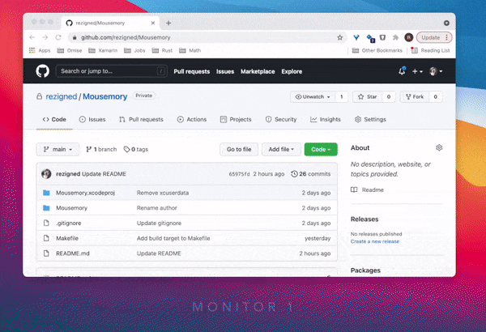

<p align="center">

</p>
<p align="center">
    <b>Mousemory</b> remembers cursor positions across multiple monitors.
</p>
<p align="center">


</p>

<p align="center">
    
</p>

## Mousemory

A simple macOS utility that records/restores mouse position across different monitors.

Whenever you switch the app via `⌘ ⇥` (cmd + tab) and the target app is on another monitor. It'll restore mouse position on that monitor for you.

## Donate

If you want to support this project. You can do it by buying me a coffee. Thanks!

<a href="https://www.buymeacoffee.com/rezigned"></a>
## Installation

**Manual**

Download latest verion [here](https://github.com/rezigned/Mousemory/releases)

**Homebrew**

```
brew install --cask mousemory
```
## Features

* Enable/disable highlight
* Customizable highlight color
* Adjustable sensitivity

## Requirements

* macOS Big Sur (11.0+)
